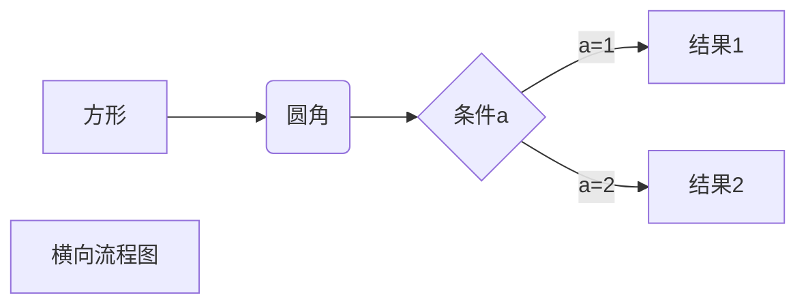
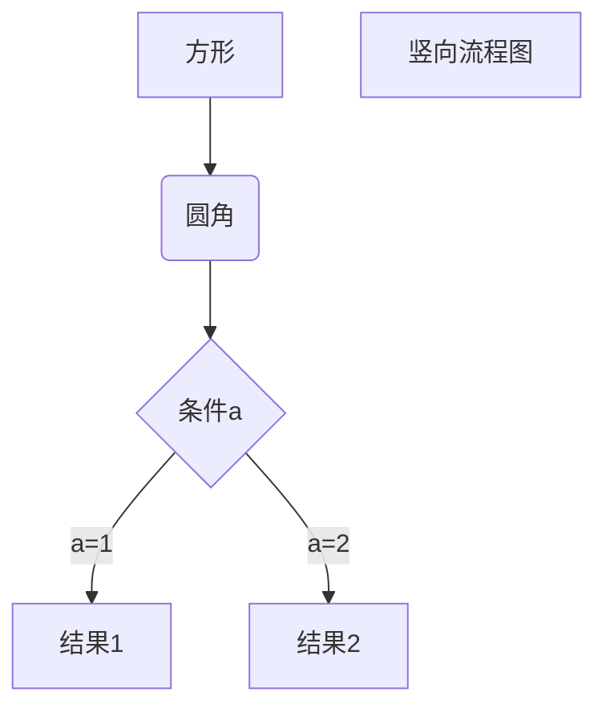
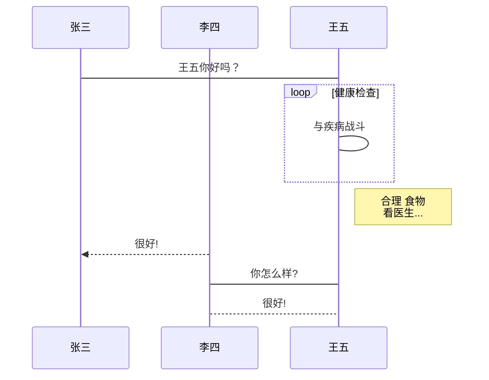
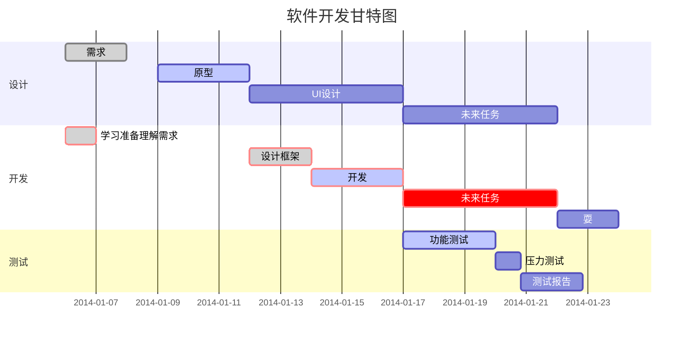

[toc]

---
## Markdown 注意事项

- 嵌套：一般在对象的行首放置4个空格或1个制表符
- 换行：在行的结束处放置2个空格后回车


## Markdown 目录

- 在文中放置`[toc]`

## Markdown 代码

### 行内代码  

- 用<code>\`</code>包裹`行内代码`

### 代码区块1：段落内的代码块  

- 用<code>```</code>包裹代码块的同时在代码块的行首放置4个空格或1个制表符

  ```javascript
  function test() {
  console.log("Hello world!");
  }
  ```
  
### 代码区块2：段落外的代码块  

- 建议使用<code>```</code>包裹代码块，或者在代码块的行首放置4个空格或1个制表符

```javascript
function test() {
console.log("Hello world!");
}
```


## Markdown 标题

- 在标题前放置1~6个`#`号

# 一级标题

## 二级标题

### 三级标题

#### 四级标题

##### 五级标题

###### 六级标题


## Markdown 段落格式

### 常用通用部分。

- 用1~3个`*`或`_`包裹文本分别实现斜体、粗体、粗斜体

*斜体文本*

_斜体文本_

**粗体文本**

__粗体文本__

***粗斜体文本*** 

**_粗斜体文本_**

### 非常用通用部分。

- 下标：使用`~`包裹文本，如H~2~O

- 上标：使用`^`包裹文本，如X^2^

- 高亮：使用`==`包裹文本，如==highlight==

- 删除线：使用`~~`包裹文本，如~~删除线~~

- 下划线：使用`<u>`包裹文本，如<u>带下划线文本</u>

- 脚注：
[^脚注文本]

[^脚注文本]: 脚注的内容

- 分隔线：3个及以上连续的`-`
  
---


## Markdown 列表

### 无序列表  

- 在`-`、`+`、`*`后面带一个空格

- 第一项

* 第二项

+ 第三项

### 有序列表  

- 在阿拉伯数字后面带一个`.`和一个空格

1. 第一项

2. 第二项

### 列表嵌套   

- 需在子列表中的行首放置4个空格或1个制表符

1. 第一项

   1. 第一项嵌套的第一个元素
   
   - 第一项嵌套的第二个元素
   
- 第二项：

  1. 第二项嵌套的第一个元素
  
  - 第二项嵌套的第二个元素

### 任务列表

- 在`-`、`+`、`*`后面带一个空格，在空格后再带一个`[ ]`，`[ ]`的后面再带一个空格，`[ ]`里面为一个空格时表示任务未完成，`[ ]`里面为一个`x`时表示任务已完成

+ [x] 已完成任务 1
- [ ] 待完成任务 2
  * [ ] 待完成任务 2-1
  - [ ] 待完成任务 2-2


## Markdown 表格

- 用`|`分隔单元格，用`-`分隔表头和其他行，用`:`控制对齐方式

```markdown
| 表头   | 左对齐 | 右对齐 | 居中对齐 |
| ------ | :----- | -----: | :------: |
| 单元格 | 单元格 | 单元格 |  单元格  |
| 单元格 | 单元格 | 单元格 |  单元格  |
```

  | 表头   | 左对齐 | 右对齐 | 居中对齐 |
  | ------ | :----- | -----: | :------: |
  | 单元格 | 单元格 | 单元格 |  单元格  |
  | 单元格 | 单元格 | 单元格 |  单元格  |


## Markdown 区块

### 区块引用  

- 需在行首放置1个`>`

> 区块引用

### 区块嵌套引用  

- 需在行首放置多个`>`

> 最外层
>> 第一层嵌套
>>
>>> 第二层嵌套

### 区块中使用列表

> 1. 第一项
> 2. 第二项
> - 第一项
> - 第二项

### 列表中使用区块

- 需要在`>`前添加四个空格的缩进

- 第一项
  
  > 区块


## Markdown 链接

### 普通链接  

```markdown
<链接地址>
[链接名称](链接地址)
[链接名称](链接地址 "可选标题")

<https://markdown-here.com>
[Markdown Here](https://markdown-here.com)
[Markdown Here](https://markdown-here.com "Markdown Here 标题")
```

<https://markdown-here.com>
[Markdown Here](https://markdown-here.com)
[Markdown Here](https://markdown-here.com "Markdown Here 标题")

### 锚点链接（在文档的结尾为变量赋值）

```markdown
[链接名称][网址变量]
[网址变量]: 链接地址

[Markdown Here][markdown_here_url]
[Markdown_Here_url]:https://markdown-here.com
```
[Markdown Here][markdown_here_url]
[Markdown_Here_url]:https://markdown-here.com

## Markdown 图片

### 一般图片链接
```markdown


)

```


### 高级链接

- 在文档的结尾为变量赋值

```markdown
![alt 属性文本][图片地址变量]
[图片地址变量]: 图片地址


![梦幻之心星][Sky-seeker_url]`
[Sky-seeker_url]: https://cdn.jsdelivr.net/gh/Sky-seeker/Pictrue_Bed/img/梦幻之心星.jpg
```


![梦幻之心星][Sky-seeker_url]
[Sky-seeker_url]: https://cdn.jsdelivr.net/gh/Sky-seeker/Pictrue_Bed/img/梦幻之心星.jpg

## Markdown 高级技巧

### 支持的 HTML 元素:

- 不在 Markdown 涵盖范围内的标签，都能直接使用。目前支持的 HTML 元素有：
`<kbd> <b> <i> <em> <sup> <sub> <br>`等。
1. 使用 <kbd>Ctrl</kbd>+<kbd>Alt</kbd>+<kbd>Del</kbd> 重启电脑
2. 特殊符号 &copy; &trade; &amp; 18&ordm;C
3. <span style="color: red;">这是一行红色的文字</span>
4. 插入视频<video src="$appres/images/example.mp4"></video>
5. Emoji 表情 :smiley:

### 转义：

- Markdown 使用了很多特殊符号来表示特定的意义，如果需要显示特定的符号则需要使用转义字符，Markdown 使用反斜杠转义特殊字符。

### 数学公式

- 使用美元符\$ 包裹 TeX 或 LaTeX 格式的数学公式

1. 行内公式 `$E=mc^2$`，如 $E=mc^2$

2. 块公式

```LaTeX
$$
\sum_{i=1}^n a_i=0
$$

$$
\mathbf{V}_1 \times \mathbf{V}_2 =  \begin{vmatrix}
\mathbf{i} & \mathbf{j} & \mathbf{k} \\
\frac{\partial X}{\partial u} &  \frac{\partial Y}{\partial u} & 0 \\
\frac{\partial X}{\partial v} &  \frac{\partial Y}{\partial v} & 0 \\
\end{vmatrix}
{$tep1}{\style{visibility:hidden}{(x+1)(x+1)}}
$$
```


$$
\sum_{i=1}^n a_i=0
$$
$$
\mathbf{V}_1 \times \mathbf{V}_2 =  \begin{vmatrix}
\mathbf{i} & \mathbf{j} & \mathbf{k} \\
\frac{\partial X}{\partial u} &  \frac{\partial Y}{\partial u} & 0 \\
\frac{\partial X}{\partial v} &  \frac{\partial Y}{\partial v} & 0 \\
\end{vmatrix}
{$tep1}{\style{visibility:hidden}{(x+1)(x+1)}}
$$


### 画图

#### 柱状图

```table:bar
衬衫   |   羊毛衫   |   雪纺衫   |   裤子   |   高跟鞋   |   袜子
15   |   20   |   36   |   10   |   10   |   20
```

#### 线图

```table:line
衬衫   |   羊毛衫   |   雪纺衫   |   裤子   |   高跟鞋   |   袜子
15   |   20   |   36   |   10   |   10   |   20
```

#### 饼图

```table:pie
衬衫   |   羊毛衫   |   雪纺衫   |   裤子   |   高跟鞋   |   袜子
15   |   20   |   36   |   10   |   10   |   20
```

#### 横向流程图源码格式：



#### 竖向流程图源码格式：



#### 标准流程图源码格式：

```flow
st=>start: 开始框
op=>operation: 处理框
cond=>condition: 判断框(是或否?)
sub1=>subroutine: 子流程
io=>inputoutput: 输入输出框
e=>end: 结束框
st->op->cond
cond(yes)->io->e
cond(no)->sub1(right)->op
```

#### 标准流程图源码格式（横向）：

```flow
st=>start: 开始框
op=>operation: 处理框
cond=>condition: 判断框(是或否?)
sub1=>subroutine: 子流程
io=>inputoutput: 输入输出框
e=>end: 结束框
st(right)->op(right)->cond
cond(yes)->io(bottom)->e
cond(no)->sub1(right)->op
```

#### UML 时序图源码样例：

```sequence
对象A->对象B: 对象B你好吗?（请求）
Note right of 对象B: 对象B的描述
Note left of 对象A: 对象A的描述(提示)
对象B-->对象A: 我很好(响应)
对象A->对象B: 你真的好吗？
```

#### UML 时序图源码复杂样例：

```sequence
Title: 标题：复杂使用
对象A->对象B: 对象B你好吗?（请求）
Note right of 对象B: 对象B的描述
Note left of 对象A: 对象A的描述(提示)
对象B-->对象A: 我很好(响应)
对象B->小三: 你好吗
小三-->>对象A: 对象B找我了
对象A->对象B: 你真的好吗？
Note over 小三,对象B: 我们是朋友
participant C
Note right of C: 没人陪我玩
```

#### UML 标准时序图样例：




#### 甘特图样例：



